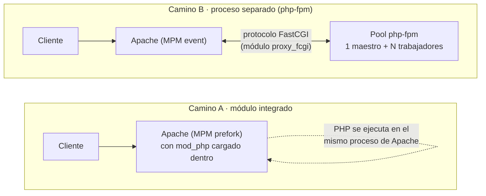

# DW2 · El entorno: Debian, LAMP y trabajo remoto

**Desenvolvemento web en contorno servidor · 2º DAW · Apuntes**

---

## Al terminar esta unidad vas a saber

- Montar un servidor Debian **sin escritorio** en VirtualBox y entrar por SSH.
- Programar desde tu Windows contra esa máquina, con tu editor de siempre.
- Instalar y comprobar Apache, MariaDB y PHP a mano.
- **Explicar, con dos trazas delante, las dos formas que tiene un servidor web de
  ejecutar código PHP**, y qué aporta la segunda.

Lo último es lo que se evalúa (CA1.3 y CA1.4). Lo demás es la herramienta.

---

## 0. Antes de empezar: lo que hay que tener instalado en Windows

Esta unidad se hace sobre tu Windows y sobre una máquina Debian que vas a crear
dentro de él. Las tres herramientas del anfitrión —VirtualBox, el cliente de SSH y
VS Code— **se instalan y se comprueban antes**, con la guía
**`GUIA_ENTORNO_WINDOWS.md`**, en la carpeta `dwes/` del material del curso. Esa
guía lleva también la instalación completa
de Debian, la importación de la OVA de rescate y qué hacer si no tienes permisos
de administrador.

No sigas con el apartado 2 sin haber pasado la lista de comprobación del punto 5
de esa guía.

---

## 1. Por qué sin escritorio

En este curso el servidor **se administra en remoto**: se llega a él por red y por
terminal, igual que al que administrarías en una empresa, que vive en un armario o
en un centro de datos. Que tenga o no una pantalla conectada no cambia lo que hace;
lo que se decide aquí es **no instalar un entorno de escritorio dentro de la VM**.

Aparte del principio, hay dos motivos prácticos:

- **La máquina vuela.** Sin escritorio le sobra con 1-2 GB de RAM; con escritorio
  necesita 4 y va lenta en el equipo del aula.
- **No pierdes tu editor.** Programas en Windows, con tu VS Code y tus atajos, y el
  código vive en la máquina. Es exactamente cómo se trabaja de verdad.

---

## 2. La máquina

### 2.1 Crear la VM

En VirtualBox: *Nueva* → tipo **Linux**, versión **Debian (64-bit)**.

| | |
|---|---|
| Memoria | **2048 MB** |
| Disco | **20 GB**, reservado dinámicamente |
| Procesadores | 2 si tu equipo tiene 4 o más |
| Red | **NAT** (por defecto) |

Como disco de arranque, la ISO **netinst de Debian 13 para amd64**
(`debian-13.x.0-amd64-netinst.iso`, ~700 MB). La copia del aula está en el USB que
reparte el profesor; el nombre exacto del fichero y su comprobación están en el
punto 2 de `dwes/GUIA_ENTORNO_WINDOWS.md`.

> **La *netinst* descarga paquetes durante la instalación.** Aunque la ISO venga en
> un USB, la VM necesita salida a internet para terminar. Si el aula no la tiene,
> se usa la OVA de rescate.

### 2.2 Instalar Debian

**El recorrido completo del instalador —idioma, teclado, red, disco, particionado y
gestor de arranque— está en el punto 3 de `dwes/GUIA_ENTORNO_WINDOWS.md`.** Aquí
solo van las tres pantallas que deciden cómo queda la máquina.

Se elige la **instalación gráfica** (*Graphical install*), que es el mismo instalador
con ratón: no tiene nada que ver con instalar un escritorio dentro de la máquina, que
es lo que se desmarca más abajo.

En el particionado se acepta **«Guiado - utilizar todo el disco»** y se confirma que
el disco que aparece es el **disco virtual de 20 GB** que acabas de crear
(`VBOX HARDDISK`), no un disco de tu Windows. Un disco virtual es un fichero dentro
de tu equipo: formatearlo no toca nada de tu ordenador.

Las tres pantallas que importan:

| Pantalla | Qué poner |
|---|---|
| Contraseña de root | **Déjala vacía** y pulsa continuar |
| Usuario | El tuyo, con una contraseña que recuerdes |
| Selección de programas | **Desmarca** «Entorno de escritorio» y «GNOME». **Marca** «Servidor SSH» y «Utilidades estándar del sistema» |

> **Lo de la contraseña de root vacía no es dejadez.** Si root no tiene contraseña,
> el instalador de Debian **deshabilita la cuenta de root**, instala `sudo` y mete a
> tu usuario en el grupo `sudo`. Si le pones contraseña a root, el instalador hace lo
> contrario: **no instala `sudo`** y tu usuario se queda sin forma de administrar.
> Cómo salir de ahí está en «Errores típicos», al final de la unidad.

Al terminar, la máquina arranca en una pantalla negra con `login:`. Eso es lo
correcto.

### 2.3 El reenvío de puerto

Con NAT, la VM puede salir a internet pero **nadie la puede llamar desde fuera**. El
reenvío de puertos abre dos puertas concretas en tu Windows y las conecta con dos
puertos de la VM.

Se configura **con la VM apagada** (*Máquina → Apagar → Apagado ACPI*, o `sudo
poweroff` dentro de la VM; no vale cerrar la ventana a lo bruto):

*Configuración* → *Red* → *Avanzado* → *Reenvío de puertos* → añadir:

| Nombre | Protocolo | IP anfitrión | Puerto anfitrión | IP invitado | Puerto invitado |
|---|---|---|---|---|---|
| ssh | TCP | **127.0.0.1** | **2222** | *(vacío)* | 22 |
| web | TCP | **127.0.0.1** | **8080** | *(vacío)* | 80 |

> **La IP del anfitrión se pone a propósito.** Dejándola vacía, VirtualBox escucha en
> todas las direcciones del equipo y cualquiera de la red del aula puede entrar en tu
> máquina. Con `127.0.0.1` solo se llega desde tu propio Windows, que es lo único que
> necesitas.

A partir de ahí, desde Windows:

- SSH → `localhost:2222`
- Navegador → `http://localhost:8080`

### 2.4 Primer arranque

Entra con tu usuario y comprueba que hay red y que SSH está vivo:

```bash
ip a                     # tu IP interna, normalmente 10.0.2.15
ping -c2 deb.debian.org
systemctl status ssh     # tiene que decir active (running). Se sale con q
```

- `ip a` lista las **interfaces** de red y la **IP** que tiene cada una. La `lo` es la
  interfaz interna de la propia máquina; la otra es la que da VirtualBox.
- `ping -c2` manda **dos** paquetes a esa dirección y espera respuesta. Si el nombre
  se resuelve pero no contesta, hay red pero algo la corta; si dice *Name or service
  not known*, lo que falla es el DNS.
- `systemctl status ssh` enseña el **estado del servicio**. Abre un paginador: se sale
  con `q`.

Y actualiza:

```bash
sudo apt update && sudo apt upgrade -y
```

`sudo` ejecuta la orden **como administrador** y pide tu contraseña. `apt update`
refresca la **lista** de paquetes disponibles —no instala nada— y `apt upgrade`
instala las versiones nuevas de lo que ya tienes; `-y` contesta que sí por
adelantado. El `&&` encadena: la segunda orden solo se ejecuta **si la primera
termina bien**.

Todas las órdenes obligatorias de esta unidad están explicadas una a una en
`dwes/INVENTARIO_COMANDOS.md`.

---

## 3. Entrar desde Windows

### 3.1 Con SSH a secas

En PowerShell:

```powershell
ssh -p 2222 tuusuario@localhost
```

- `ssh` es el **cliente**: el programa que llama. El servidor es el `sshd` que corre
  dentro de la VM.
- `-p 2222` es el **puerto** al que llama, que es el que reenvía VirtualBox.
- `tuusuario@localhost` es **con qué cuenta** y **a qué máquina**: la cuenta es la de
  Debian, no la de Windows, y `localhost` aquí es tu propio Windows, que es quien
  tiene abierto el 2222.

La primera vez pregunta si te fías de la máquina y enseña una **huella**: es el
resumen de la clave del servidor, y sirve para detectar que mañana no te está
contestando otra máquina distinta. Se contesta `yes` **escrito entero**. Después pide
la **contraseña de tu usuario de Debian**, que no se ve al teclearla.

Para volver a Windows, `exit`.

> Si algún día sale un aviso grande de *REMOTE HOST IDENTIFICATION HAS CHANGED*, es
> que la huella no coincide. Pasa al reinstalar la VM o al importar la OVA: se borra
> la línea vieja con `ssh-keygen -R "[localhost]:2222"` y se vuelve a entrar.

### 3.2 Sin escribir la contraseña cada vez

Una **pareja de claves** son dos ficheros que van juntos: la **privada** (`id_ed25519`)
no sale nunca de la máquina donde se creó, y la **pública** (`id_ed25519.pub`) se
copia al servidor al que quieres entrar. El servidor guarda las públicas que acepta
en su fichero `~/.ssh/authorized_keys`.

**Quién llama a quién importa:** aquí **Windows llama a Debian**, así que la pareja se
crea **en Windows** y la pública se copia **a Debian**. En DW3 será al revés —Debian
llamará a GitHub— y por eso allí se crea **otra** pareja dentro de Debian. Son dos
recorridos distintos y cada uno tiene la suya.

**Paso 1 · crear la pareja, en PowerShell:**

```powershell
ssh-keygen -t ed25519 -C "windows-a-debian"
```

- Pregunta dónde guardarla: Enter, para el sitio por defecto.
- Pregunta una *passphrase*: puedes dejarla vacía con Enter.
- **Si dice `id_ed25519 already exists. Overwrite (y/n)?`, contesta `n`**: ya tienes
  una pareja y sobrescribirla te dejaría fuera de cualquier sitio donde la hubieras
  puesto. Sigue con la que tienes.

**Paso 2 · mirar la pública**, que es la que se copia:

```powershell
type $env:USERPROFILE\.ssh\id_ed25519.pub
```

`$env:USERPROFILE` es tu carpeta personal de Windows (`C:\Users\loquesea`). Tiene que
salir **una línea** que empieza por `ssh-ed25519`.

Selecciona esa clave y usa Ctrl + c o botob derecho Copiar.

**Paso 3 · copiarla a Debian.** En la VM, por SSH con contraseña:

Conéctate por SSH a Debian como hicimos antes.

```bash
mkdir -p ~/.ssh
chmod 700 ~/.ssh
nano ~/.ssh/authorized_keys      # se pega la línea entera, sin cortarla
chmod 600 ~/.ssh/authorized_keys
```

`~` es tu carpeta personal dentro de Debian (`/home/tuusuario`). Los permisos `700` y
`600` dicen «solo el dueño»: si están más abiertos, el servidor SSH **ignora** el
fichero por seguridad y te seguirá pidiendo la contraseña.

**Paso 4 · comprobar.** Sal con `exit` y vuelve a entrar: ya no pide contraseña.

> **Esta clave es solo para entrar de Windows a tu VM.** La de GitHub se crea en DW3,
> dentro de Debian. No copies nunca la clave **privada** de un sitio a otro.

### 3.3 Con VS Code

1. Instala la extensión **Remote - SSH** (Microsoft).
2. `F1` → *Remote-SSH: Connect to Host* → *Add New SSH Host* →
   `ssh -p 2222 tuusuario@localhost`.
3. Conecta. Abajo a la izquierda pone **SSH: localhost**.
4. Antes de abrir nada, crea la carpeta del proyecto **desde el terminal integrado**
   (`Ctrl+ñ`), porque todavía no existe:

   ```bash
   mkdir -p ~/proyecto/public ~/proyecto/config
   ```

5. *Abrir carpeta* → `/home/tuusuario/proyecto`.

A partir de ahí: el editor está en Windows, **los ficheros y el terminal están en la
VM**. El terminal integrado (`Ctrl+ñ`) es un terminal de Debian. Todo lo que hagas
ahí pasa dentro del servidor.

> **Lo que se rompe si no lo entiendes:** si abres una carpeta de Windows y editas
> ahí, el servidor no ve nada. La comprobación es el terminal integrado: `pwd` dice
> en qué carpeta estás y `ls` enseña lo que hay dentro. Si `pwd` contesta
> `/home/tuusuario/proyecto`, estás donde tienes que estar; si empieza por `C:\`, no.

---

## 4. La pila: Apache, MariaDB y PHP

Antes de instalar nada, qué son estos dos programas y qué papel juega cada uno:

**Apache** es un *servidor web*: un programa que se queda corriendo en segundo plano,
escuchando en un puerto (el 80), y que cuando le llega una petición HTTP responde con
algo —un fichero tal cual, o lo que genere otro programa al que Apache le pase la
petición—. No es un lenguaje de programación ni guarda datos por su cuenta: su trabajo
es **atender peticiones y decidir qué contestar**. No es el único servidor web que
existe (Nginx es otro muy usado), pero es el más extendido en hosting compartido y el
que trae Debian con menos fricción, por eso es el de este curso.

**MariaDB** es un *sistema gestor de bases de datos relacional*: un servicio aparte,
con su propio proceso, que guarda los datos organizados en tablas y los entrega
mediante el lenguaje **SQL**. Es un *fork* de MySQL —mismo origen, misma sintaxis,
compatible en casi todo— que Debian trae por defecto desde hace años en lugar de
MySQL. Apache y MariaDB **no se pisan**: Apache no guarda datos de forma permanente y
MariaDB no sirve páginas; son dos servicios independientes que se hablan por red (aquí,
contra `127.0.0.1`, es decir, la propia máquina) cuando el código PHP necesita leer o
escribir en la base de datos.

```bash
sudo apt install -y apache2 mariadb-server php libapache2-mod-php php-mysql php-fpm curl git python3
```

Qué es cada paquete, porque no son todos la misma clase de cosa:

| Paquete | Qué es |
|---|---|
| `apache2` | El **servidor web**: un servicio que escucha en el puerto 80 y responde peticiones |
| `mariadb-server` | El **servidor de base de datos**, otro servicio. Trae también el cliente `mariadb` |
| `php` | El **intérprete** de PHP y su versión de línea de órdenes (`php`) |
| `libapache2-mod-php` | El **módulo** que mete PHP dentro de Apache: el camino A del apartado 5 |
| `php-mysql` | La **extensión** de PHP que le permite hablar con MariaDB (es la que trae PDO MySQL) |
| `php-fpm` | El **servicio** de PHP aparte: el camino B del apartado 5 |
| `curl` | Un **cliente** de línea de órdenes para pedir páginas sin navegador |
| `git`, `python3` | Se instalan hoy porque los necesitas en DW3. Aquí no se usan |

Servicio, módulo y extensión no son sinónimos: un **servicio** es un programa que
queda corriendo, un **módulo** es una pieza que se carga dentro de otro programa, y
una **extensión** es una pieza que se carga dentro de PHP.

Comprobación inmediata, desde Windows: `http://localhost:8080` tiene que enseñar la
página por defecto de Apache.

### 4.1 Dónde está cada cosa

| Cosa | Sitio |
|---|---|
| Raíz del sitio por defecto (*DocumentRoot*) | `/var/www/html` — **se va a cambiar en 4.3** |
| Configuración de los sitios | `/etc/apache2/sites-available/` |
| Sitios activados | `/etc/apache2/sites-enabled/` |
| Módulos activos | `/etc/apache2/mods-enabled/` |
| Registro de accesos | `/var/log/apache2/access.log` |
| Registro de errores | `/var/log/apache2/error.log` |

Tres carpetas del sistema que conviene distinguir: `/etc` guarda **configuración**,
`/var/log` guarda **registros** de lo que ha ido pasando y `/var/www` es donde Debian
deja por defecto **lo que se sirve por web**.

Los dos registros se miran así, y se van a mirar mucho:

```bash
sudo tail -f /var/log/apache2/error.log
```

`tail -f` enseña el final del fichero y **se queda esperando** a que aparezcan líneas
nuevas: es para dejarlo abierto mientras recargas la página en el navegador. Para
recuperar el prompt se pulsa **`Ctrl+C`**. Si una orden abre un paginador y la pantalla
se queda fija (le pasa a `systemctl status`), se sale con **`q`**.

### 4.2 La base de datos

```bash
sudo mariadb-secure-installation
```

Va preguntando por pantalla. Estas son las respuestas **para esta instalación
concreta**, recién hecha y sin datos:

| Pregunta | Qué contestar y por qué |
|---|---|
| *Enter current password for root* | **Enter**, a secas: el root de MariaDB todavía no tiene contraseña |
| *Switch to unix_socket authentication* | **n**. Debian ya lo hace: el root de MariaDB se identifica por ser root del sistema, y por eso entras con `sudo mariadb` |
| *Change the root password* | **n**, por lo mismo. No hay contraseña que cambiar |
| *Remove anonymous users* | **y** |
| *Disallow root login remotely* | **y** |
| *Remove test database* | **y** |
| *Reload privilege tables* | **y** |

No es «Enter a todo»: las dos primeras se contestan así porque Debian configura el
root de MariaDB por *socket*, y las cuatro últimas se contestan «sí» porque son
cosas que en un servidor no se quieren.

> **El root de MariaDB no es el root de Linux.** Se llaman igual y no son la misma
> cuenta.

Y ahora el usuario de la aplicación, que **no es root**. Con `sudo mariadb` cambias
de intérprete: dejas de escribir órdenes de Linux y pasas a escribir **SQL**, que
termina en `;`. Se sale con `exit`.

```sql
sudo mariadb
CREATE DATABASE expediciones CHARACTER SET utf8mb4 COLLATE utf8mb4_unicode_ci;
CREATE USER 'app'@'localhost' IDENTIFIED BY '1234';
GRANT SELECT, INSERT, UPDATE, DELETE ON expediciones.* TO 'app'@'localhost';
SHOW GRANTS FOR 'app'@'localhost';
exit
```

Línea a línea: `CREATE DATABASE` crea la base y le fija la **codificación**
(`utf8mb4` admite acentos, ñ y emojis) y la **colación**, que es cómo se ordena y se
compara el texto. `CREATE USER ... @'localhost'` crea una cuenta que **solo vale
conectando desde la propia máquina**. `GRANT` le da permisos, y `SHOW GRANTS`
enseña los que tiene de verdad, que es lo que hay que leer.

**Solo cuatro permisos.** Nada de `ALL PRIVILEGES`, nada de `DROP`. Si tu código
tiene un fallo, que el fallo no pueda borrar la base entera.

> Aquí **no hace falta `FLUSH PRIVILEGES`**: esa orden solo se necesita cuando se
> tocan a mano las tablas de permisos. `CREATE USER` y `GRANT` ya se aplican solos.

### 4.3 Un solo árbol, y las credenciales fuera de lo servido

**Todo el curso se trabaja en una sola carpeta: `~/proyecto`**, es decir
`/home/tuusuario/proyecto`. Es tuya, la edita VS Code sin pedir permisos de
administrador y es la que en DW3 se convierte en el repositorio. **No se trabaja en
`/var/www`**: esa carpeta es de root y obligaría a usar `sudo` para cada fichero.

```
/home/tuusuario/proyecto/
├── config/
│   └── credenciales.php     <- fuera de lo servido: Apache no llega aquí
└── public/                  <- esto y solo esto es lo que se publica
    ├── index.html
    └── index.php
```

La contraseña **no va dentro de `public/`**. Va un nivel por encima.

> **El fallo que hay que evitar:** dejar `credenciales.php` dentro de la carpeta
> pública. Si un día PHP deja de ejecutarse por un error de configuración, el
> servidor sirve ese fichero **como texto** y regala la contraseña.

Crea el fichero de credenciales y déjalo solo para ti:

```bash
nano ~/proyecto/config/credenciales.php
```
Pegamos este código.

```php
<?php
return [
    'servidor' => '127.0.0.1',
    'base'     => 'expediciones',
    'usuario'  => 'app',
    'clave'    => 'la-que-pusiste-en-el-CREATE-USER',
];
```
Aplicamos permisos.

```bash
chmod 600 ~/proyecto/config/credenciales.php
```
Y una página estática y una dinámica para tener algo que servir:

```bash
echo '<h1>Expediciones</h1>' > ~/proyecto/public/index.html
echo '<?php echo "PHP vivo";' > ~/proyecto/public/index.php
```

#### Decirle a Apache dónde está el sitio

Apache corre como el usuario `www-data`, así que tiene que poder **atravesar** tu
carpeta personal para llegar a `public/`. Eso es lo único que se abre:

```bash
sudo chmod o+x /home/tuusuario           # atravesar, no listar
chmod -R o+rX ~/proyecto/public          # leer lo publicado
```

**Qué es un *virtual host*.** Un mismo Apache, en una sola máquina y con una sola IP,
puede servir varios sitios distintos a la vez: cada sitio se define en un bloque
`<VirtualHost>`, con su propio `DocumentRoot`, sus propios permisos y sus propios
registros, y Apache elige qué bloque usar según el puerto —o, con varios sitios en el
mismo puerto, según el nombre— por el que llega la petición. Es el mismo mecanismo que
usa cualquier hosting compartido para meter cientos de webs distintas en un único
servidor físico. Aquí solo se define un sitio (`*:80`: cualquier IP, puerto 80), así
que hay un único bloque `<VirtualHost>`, pero conviene saber que el fichero se llama
así porque este es exactamente el mecanismo, aunque de momento solo se use para uno.

El fichero del sitio, con tu nombre de usuario dentro:

```bash
sudo nano /etc/apache2/sites-available/proyecto.conf
```

```apache
<VirtualHost *:80>
    DocumentRoot /home/tuusuario/proyecto/public

    <Directory /home/tuusuario/proyecto/public>
        Options -Indexes +FollowSymLinks
        AllowOverride None
        Require all granted
    </Directory>

    ErrorLog  ${APACHE_LOG_DIR}/proyecto_error.log
    CustomLog ${APACHE_LOG_DIR}/proyecto_access.log combined
</VirtualHost>
```

Se activa el sitio nuevo, se desactiva el que venía de fábrica, **se comprueba la
configuración antes de aplicarla** y se recarga:

```bash
sudo a2ensite proyecto
sudo a2dissite 000-default
sudo apache2ctl configtest      # tiene que decir: Syntax OK
sudo systemctl reload apache2
```

`a2ensite` y `a2dissite` activan y desactivan **sitios**; `a2enmod` y `a2dismod`, que
salen en el apartado 5, hacen lo mismo con **módulos**. Ninguno de los cuatro aplica
nada por su cuenta: hay que recargar o reiniciar Apache después.

Comprueba desde Windows que `http://localhost:8080` enseña tu `index.html`, y que
`http://localhost:8080/config/credenciales.php` da **404**. Si diera la contraseña,
el `DocumentRoot` está mal puesto.

> **A partir de aquí, `/var/www/html` ya no se usa para nada.** Todo lo que escribas
> va a `~/proyecto/public`.

### 4.4 Comprobar sin capturas de pantalla

El comprobador está publicado en el repositorio en `material/herramientas/comprobar_entorno.sh`. Hay que
**descargarlo en tu Windows y copiarlo a la VM** —arrastrándolo a la ventana de VS
Code conectada, que es lo más rápido— y ejecutarlo **dentro de la VM**:

```bash
cd ~/proyecto
bash comprobar_entorno.sh
```

Comprueba Apache, PHP, MariaDB, SSH, los puertos y las credenciales, y dice qué
falta. Al final escribe `N correctas, M pendientes` y devuelve un **estado de salida**
0 o 1, que es lo que lee el corrector.


Para guardar la salida **sin los códigos de color**, que ensucian el fichero:

```bash
mkdir -p ~/proyecto/entorno
bash comprobar_entorno.sh | tee ~/proyecto/entorno/comprobacion.txt
```

La entrega de esta unidad es ese fichero, no una foto de la pantalla.

---

## 5. Las dos formas de ejecutar PHP

Esto es el núcleo de la unidad. El resto existe para poder llegar aquí.

### 5.0 Diez palabras que hacen falta para entender lo que viene

No hay que dominarlas: hay que poder usarlas hoy. Lo demás llega en DW4.

| Palabra | Qué significa aquí |
|---|---|
| **Cliente y servidor** | El cliente pide; el servidor responde. Tu navegador y `curl` son clientes; Apache es el servidor |
| **Petición y respuesta** | Cada página son dos mensajes: uno de ida con lo que se pide y otro de vuelta con el contenido y un **código** |
| **`localhost`** | «esta misma máquina». Escrito **dentro de la VM** significa la VM; escrito en Windows significa Windows, y por eso desde allí hace falta el puerto 8080 y el reenvío |
| **Puerto** | El número de la puerta. Apache escucha en el 80; SSH, en el 22 |
| **Página estática / dinámica** | La estática es un fichero que se manda tal cual (`index.html`). La dinámica es un programa que se ejecuta y **genera** la respuesta (`index.php`) |
| **Proceso y servicio** | Un proceso es un programa en ejecución, con su número (**PID**) y el de quien lo lanzó (**PPID**). Un servicio es un proceso que el sistema arranca y mantiene vivo |
| **Maestro y trabajador** | Algunos servicios tienen un proceso **maestro**, que no atiende peticiones, y varios **trabajadores**, que sí. El PPID de los trabajadores es el PID del maestro |
| **SAPI** | *Server API*: la forma en que PHP se enchufa a quien lo llama. Es el dato que vas a leer |
| **MPM** | *Multi-Processing Module*: la pieza de Apache que decide cómo reparte las peticiones entre procesos. `prefork` usa un proceso completo por petición; `event` es más eficiente pero no puede llevar PHP cargado dentro |
| **FastCGI** | El protocolo con el que Apache le pasa una petición a un programa externo (como php-fpm) y recibe la respuesta, sin tener que cargarlo dentro de sí mismo. El módulo que lo habla en Apache es `proxy_fcgi` |

Y dos códigos de respuesta, que en DW4 se ven a fondo:

- **200**, la respuesta normal: aquí está lo que pediste.
- **503**, *servicio no disponible*: el servidor web está vivo pero no ha podido
  conseguir la respuesta de quien tenía que generarla.

Una petición a `/traza.php` puede resolverse de **dos maneras distintas en la misma
máquina**. Antes de tocar ningún comando, así es la diferencia:



En el camino A, Apache y PHP son **el mismo proceso**: parar uno para el otro. En
el camino B son **dos programas que se hablan por FastCGI**: se puede parar PHP sin
tocar Apache. Eso es justo lo que vas a comprobar en el apartado 5.3.

Vamos a servir la misma página `/traza.php` por los dos caminos y a leer las dos
trazas.

El fichero de prueba, en `~/proyecto/public/traza.php`:

```php
<?php
echo "SAPI: ", php_sapi_name(), "\n";
echo "PID:  ", getmypid(), "\n";
echo "Usuario: ", trim(shell_exec('id -un')), "\n";
```

Cuatro cosas de este fichero, para poder leerlo sin saber PHP todavía:

- `<?php` abre el trozo de programa; todo lo que va detrás se ejecuta en el servidor.
- `echo` escribe en la respuesta. Las comas separan los trozos que se escriben
  seguidos, y `"\n"` es un salto de línea.
- `php_sapi_name()`, `getmypid()` y `shell_exec()` son **funciones**: se les llama con
  paréntesis y devuelven un dato. `trim()` quita los espacios sobrantes del resultado.
- No hay que saber escribirlo. Se usa como un **instrumento de medida**: PHP se está
  identificando a sí mismo.

`php_sapi_name()` dice **quién está ejecutando PHP**. Es la traza.

### 5.1 Camino A · el módulo integrado en Apache

Los dos caminos son **incompatibles**: el módulo integrado necesita el MPM `prefork`,
y el servicio aparte usa `event`. Así que cada modo se prepara entero, apagando lo
del otro. El paquete `php-fpm` deja su servicio **arrancado** nada más instalarse, y
por eso el camino A empieza parándolo: si no, quedan procesos suyos rondando aunque
Apache no los use, y la lista de procesos engaña.

```bash
sudo systemctl stop php8.4-fpm       # tu versión: ls /etc/php/
sudo a2disconf php8.4-fpm
sudo a2dismod mpm_event proxy_fcgi
sudo a2enmod mpm_prefork
sudo a2enmod php8.4                  # mira tu versión: ls /etc/apache2/mods-available/php*
sudo apache2ctl configtest           # Syntax OK
sudo systemctl restart apache2
curl http://localhost/traza.php
```

Salida real:

```
SAPI: apache2handler
PID:  12444
Usuario: www-data
```

Y los procesos de la máquina:

```
$ ps -eo comm | sort | uniq -c | grep -E "apache|php"
      6 apache2
```

Esa orden encadena cuatro cosas con **tuberías** (`|`), que pasan la salida de una a
la siguiente: `ps -eo comm` lista **todos** los procesos enseñando solo la columna del
nombre; `sort` los ordena; `uniq -c` agrupa los repetidos y **cuenta** cuántos hay de
cada uno; y `grep -E "apache|php"` se queda solo con las líneas que contienen
`apache` **o** `php`.

**Procesos de Apache, y ninguno de PHP.** No hay proceso de PHP porque **PHP está
dentro de Apache**: el módulo se carga en cada proceso del servidor web y el código
se ejecuta ahí mismo.

> **El número no es el dato.** Cuántos procesos de Apache haya depende de la máquina y
> del momento: en la tuya pueden ser cuatro, seis u ocho, y los PID no van a coincidir
> con los de nadie. Lo que hay que mirar es **qué familias de procesos aparecen** y
> qué dice la SAPI.

### 5.2 Camino B · el proceso separado (php-fpm)

```bash
sudo a2dismod php8.4
sudo a2dismod mpm_prefork
sudo a2enmod mpm_event proxy_fcgi setenvif
sudo a2enconf php8.4-fpm
sudo systemctl start php8.4-fpm
sudo systemctl enable php8.4-fpm     # que arranque solo al encender la máquina
sudo apache2ctl configtest           # Syntax OK
sudo systemctl restart apache2
curl http://localhost/traza.php
```

`proxy_fcgi` es el módulo que le da a Apache la mitad cliente del protocolo FastCGI:
sin él, Apache no sabe hablar con el pool de php-fpm. `setenvif` no es opcional aquí:
`a2enconf php8.4-fpm` lo necesita para decidir, según la URL, qué peticiones se
reenvían al pool. `mpm_event` es el MPM que hace falta para poder cargar `proxy_fcgi`,
por eso los tres se activan juntos.

Salida real:

```
SAPI: fpm-fcgi
PID:  12874
Usuario: www-data
```

Y los procesos:

```
$ ps -eo user,pid,ppid,comm | grep -E "apache2|php-fpm"
root     12873     1     php-fpm8.4      <- el maestro
www-data 12874 12873     php-fpm8.4      <- trabajador
www-data 12875 12873     php-fpm8.4      <- trabajador
root     13266     1     apache2
www-data 13267 13266     apache2
www-data 13269 13266     apache2
```

Ahora hay **dos programas distintos**: Apache atiende la petición y, cuando toca
PHP, se la pasa a un **pool de procesos** que vive aparte. Eso es un *servidor de
aplicaciones* integrado con el servidor web.

> **Ver procesos de `php-fpm` no demuestra por sí solo que se estén usando**: pueden
> estar ahí parados sin atender nada. Lo que lo demuestra es la **SAPI** de la
> respuesta. Por eso la traza es el instrumento y `ps` solo el acompañamiento.

**Este es el estado en el que se queda la máquina para el resto del curso.** Si
haces el camino A otra vez para probar, vuelve después a estas órdenes.

### 5.3 La demostración que lo deja claro

Con php-fpm puesto, **tira solo el pool de PHP** y pide las dos cosas:

```
$ sudo systemctl stop php8.4-fpm

  PHP con el pool parado : 503
  HTML estatico          : 200

$ sudo systemctl start php8.4-fpm

  tras levantar el pool  : 200      (Apache no se ha reiniciado)
```

Los dos códigos se piden así, y la orden se lee por partes:

```bash
curl -s -o /dev/null -w "PHP:  %{http_code}\n" http://localhost/traza.php
curl -s -o /dev/null -w "HTML: %{http_code}\n" http://localhost/index.html
```

`-s` calla la barra de progreso; `-o /dev/null` **tira el contenido** de la respuesta,
porque aquí no interesa; `-w` dice qué escribir al terminar, y `%{http_code}` se
sustituye por el código de la respuesta. `\n` es el salto de línea, sin el cual los
dos resultados salen pegados. La petición sale **de la propia VM**, así que aquí
`localhost` es la VM y el puerto es el 80.

Ahí están los tres argumentos, y no hay que creérselos: se ven.

> **Cuidado con lo que se concluye de esto.** Que un *script* de PHP dé un error, o
> que un trabajador se muera, no tira ningún servidor: con el módulo integrado Apache
> usa el MPM `prefork`, que atiende cada petición en un proceso distinto, y las demás
> siguen. Lo que aquí se compara es **poder parar y reiniciar PHP por separado**: con
> el módulo integrado, parar PHP significa parar Apache entero —y con él lo
> estático—; con el servicio aparte, no.

| | Módulo integrado | Proceso separado (php-fpm) |
|---|---|---|
| `php_sapi_name()` | `apache2handler` | `fpm-fcgi` |
| Procesos | PHP dentro de Apache | Un pool aparte, con su maestro |
| Si el pool de PHP se para | No hay pool: PHP se para **parando Apache**, y con él lo estático | **Apache sigue en pie y sigue sirviendo lo estático** |
| Reiniciar PHP | Reinicias Apache entero | **Reinicias solo el pool** |
| Usuario del proceso | El de Apache | **Puede ser otro distinto** |
| Varias versiones de PHP | Una | **Varias a la vez, un pool cada una** |
| MPM que puede usar Apache | `prefork` (más memoria) | `event` (más eficiente) |

### 5.4 Lo que hay que poder decir en tres frases

1. **El módulo integrado** mete PHP dentro del servidor web: simple, y todo va en el
   mismo saco.
2. **El proceso separado** deja PHP fuera y Apache le pasa el trabajo: se puede
   reiniciar, aislar y dimensionar por su cuenta.
3. Por eso a php-fpm se le llama **servidor de aplicaciones**: no sirve ficheros,
   ejecuta programas, y se **integra** con el servidor web por un protocolo
   (FastCGI).

---

## Errores típicos

| Síntoma | Qué pasa de verdad |
|---|---|
| El navegador descarga el `.php` en vez de ejecutarlo | PHP no está activo en Apache. `a2enmod` o `a2enconf`, y reiniciar |
| «Forbidden» al abrir la carpeta | Faltan permisos o no hay `index.php`/`index.html` |
| Cambio el fichero y no cambia nada | Estás editando en Windows, no en la VM. Mira el terminal integrado |
| `sudo: command not found` | Le pusiste contraseña a root al instalar, así que `sudo` **no está instalado**. Ver abajo |
| `tuusuario is not in the sudoers file` | `sudo` sí está, pero tu usuario no está en el grupo. Ver abajo |
| 503 en todo lo PHP | php-fpm está parado. `systemctl status php8.4-fpm` |
| Funciona con `localhost` en la VM pero no desde Windows | Falta el reenvío de puertos, o Apache escucha solo en 127.0.0.1 |

### Si `sudo` no funciona

Son dos averías distintas y se arreglan de forma distinta. Las dos se hacen **en la
consola de la VM**, no por SSH.

**Caso 1 · `sudo: command not found`.** El programa no está. Entra como `root` con la
contraseña que pusiste en el instalador e instálalo:

```bash
su -                       # pide la contraseña de root
apt update
apt install -y sudo
usermod -aG sudo tuusuario # ahora sí: mete a tu usuario en el grupo
exit                       # sales de root
exit                       # cierras la sesión: el grupo nuevo solo se ve al volver a entrar
```

**Caso 2 · `tuusuario is not in the sudoers file`.** `sudo` está instalado y solo
falta el grupo: entra como root y ejecuta únicamente la línea del `usermod`, y vuelve
a iniciar sesión.

> **Si dejaste root sin contraseña y aun así no tienes `sudo`**, no puedes entrar
> como root: no hay contraseña que valga. Ahí la vía rápida es importar la OVA de
> rescate (punto 4 de `dwes/GUIA_ENTORNO_WINDOWS.md`) y seguir.

> **Root de Linux y root de MariaDB no tienen nada que ver.** Son dos cuentas de dos
> sistemas distintos que se llaman igual. La contraseña de una no sirve para la otra.

---

## Resumen en una página

- Debian **sin escritorio**, SSH activado, reenvío `2222→22` y `8080→80`.
- Root sin contraseña en la instalación → tu usuario tiene `sudo`.
- Clave SSH **de Windows a la VM**, creada en Windows. La de GitHub es **otra**, y se
  crea dentro de Debian en DW3.
- VS Code + Remote-SSH: editas en Windows, ejecutas en la VM.
- Un solo árbol: `~/proyecto`, con `public/` como `DocumentRoot` y `config/` fuera.
- `apache2 mariadb-server php libapache2-mod-php php-mysql php-fpm curl git python3`.
- Usuario de base de datos con **cuatro permisos**, y credenciales **fuera** del
  árbol público.
- `php_sapi_name()` es la traza: `apache2handler` frente a `fpm-fcgi`.
- Con el pool parado, lo estático sigue sirviéndose. Ese es el argumento entero.

